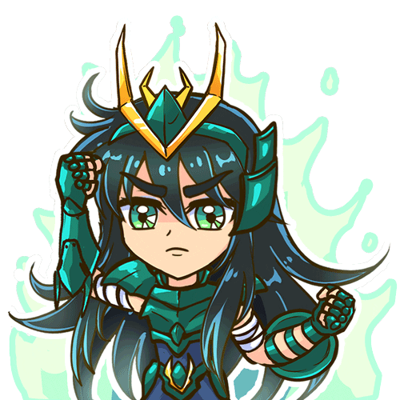

<h1 align="center">João Vinícius</h1>

###

<h4 align="left">Sou do Maranhão, tenho 25 anos e curso Análise e desenvolvimento de Sistemas na UEMA. Trabalho como Técnico de Informática desde 2015, e atualmente atuo como Micro Empreendedor Individual.</h4>

###

 

  
  
  
  

###

<h2 align="left">Skills</h2>

###

  
  
  
  
  
  
  
  
  
  
  
  
  
  
  
  
  
  
  
  
  
  
  
  
  
  
  
  
  
  
  

###

<h2 align="left">GitHub Stats</h2>

###

  

###
